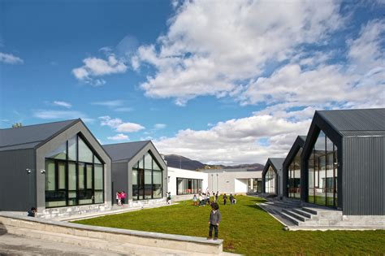

# Իմ մասին

Ողջույն! Ես Վահագն Ամիրխանյանն եմ։ Ես Դիլիջանի կենտրոնական դպրոցի աշակերտ եմ։ff

## Իմ մասին

Ես ծնվել եմ Վանաձորում, սակայն այժմ սովորում եմ Դիլիջանում։ Դիլիջանում ես ոչ միայն ստանում եմ կրթություն, այլև հաճախում եմ FabLab, որտեղ հնարավորություն ունեմ սովորելու նոր տեխնոլոգիաների, ստեղծարարության և տարբեր նախագծերի մասին։ Ինձ հետաքրքրում է նոր բաներ սովորելը, փորձարկելը և սեփական գաղափարները իրականություն դարձնելը։ 
## Ինչու եմ ես այստեղ

Fab Academy-ն ինձ համար նոր տեխնոլոգիական հորիզոններ բացելու և գործնական հմտություններ զարգացնելու լավագույն հարթակն է։ Ես ցանկանում եմ ոչ միայն սովորել ծրագրավորում և հասկանալ համակարգերի աշխատանքը, այլև իմ կոդն ու թվային մոդելները վերածել իրական առարկաների։ 2D և 3D դիզայնը, էլեկտրոնիկան, CNC հաստոցներն ու լազերային կտրումն այն գործիքներն են, որոնց միջոցով ուզում եմ կյանքի կոչել իմ գաղափարները։
