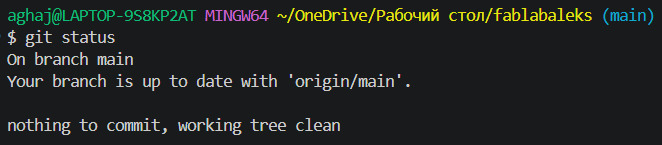
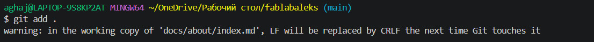
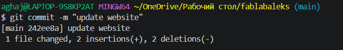
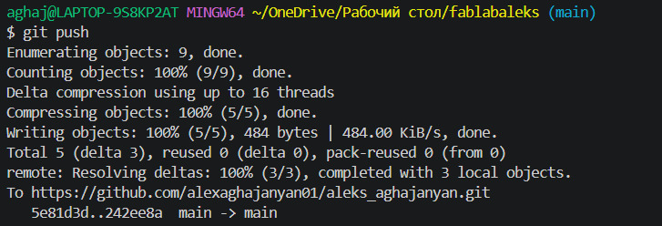

# 1. Website ստեղծում

Fab Academy-ի ընթացքում իմ աշխատանքների կարևոր մասն է նախագծերի ճիշտ կազմակերպումը, տարբեր գործիքների օգտագործումը և կատարված աշխատանքների փաստագրումը։

Իմ աշխատանքային միջավայրը Windows օպերացիոն համակարգն է։ Git-ի հետ աշխատելու համար օգտագործում եմ Git Bash, իսկ կոդը և փաստաթղթերը խմբագրելու համար՝ Visual Studio Code (VS Code)։

Git-ի կարգավորում

Սկզբում տեղադրեցի Git-ը իմ Windows համակարգչի վրա։ Այնուհետև բացեցի Git Bash և ստուգեցի, որ Git-ը ճիշտ է աշխատում.

git --version

Հաջորդ քայլում կարգավորեցի իմ Git username-ը.

git config --global user.name "Aleks"

Այնուհետև կարգավորեցի իմ email-ը.

git config --global user.email "YOUR_EMAIL"

Կարգավորումները ստուգելու համար օգտագործեցի.

git config --global --list

Այս կարգավորումներից հետո իմ համակարգիչը պատրաստ էր GitHub-ի հետ աշխատելու համար։

GitHub և իմ repository-ն

Fab Academy-ի ընթացքում իմ աշխատանքները պահելու և հրապարակելու համար օգտագործում եմ GitHub։ GitHub-ը թույլ է տալիս պահել իմ նախագծերի ֆայլերը online repository-ում, հետևել կատարված փոփոխություններին և պահպանել աշխատանքի տարբեր տարբերակները։

Իմ Fab Academy repository-ի անունն է aleks_aghajanyan։ Այդ repository-ում պահում եմ իմ աշխատանքները, documentation-ը, Markdown ֆայլերը և նախագծերի հետ կապված այլ նյութեր։

Իմ repository-ն համակարգչիս ներբեռնելու համար օգտագործեցի git clone հրամանը.

git clone YOUR_GITHUB_REPOSITORY_URL

Դրանից հետո մտա project folder.

cd YOUR_PROJECT_FOLDER

Այժմ կարող էի աշխատել իմ նախագծի ֆայլերի հետ անմիջապես համակարգչիս վրա։

Git-ի հիմնական հրամանները

Աշխատանքի ընթացքում հիմնականում օգտագործում եմ հետևյալ Git հրամանները։

Փոփոխությունները ստուգելու համար - git status

Փոփոխված ֆայլերը Git-ին ավելացնելու համար - git add .

Փոփոխությունները commit անելու համար - git commit -m "update website"

Իսկ փոփոխությունները իմ GitHub repository ուղարկելու համար - git push 

Այս հրամանների միջոցով կարողանում եմ պահպանել իմ աշխատանքի փոփոխությունները և թարմացնել իմ Fab Academy կայքը։

MkDocs

Իմ փաստաթղթերը կայքի վերածելու համար օգտագործում եմ MkDocs։ Այն թույլ է տալիս Markdown ֆայլերից ստեղծել documentation website։

Իմ project folder-ը բացելուց հետո MkDocs-ը գործարկում եմ Git Bash-ի կամ VS Code-ի terminal-ի միջոցով.

mkdocs serve

Դրանից հետո MkDocs-ը ստեղծում է տեղային server, և ես կարող եմ browser-ում տեսնել իմ կայքը։

Այս եղանակով կարող եմ նախ ստուգել իմ documentation-ը, տեսնել՝ արդյոք ամեն ինչ ճիշտ է դասավորված, և անհրաժեշտ փոփոխությունները կատարել մինչև դրանք GitHub repository ուղարկելը։

AI-ի օգտագործումը VS Code-ում

Իմ աշխատանքի ընթացքում օգտագործում եմ նաև AI գործիքներ VS Code-ի միջավայրում։ AI-ն ինձ օգնում է ավելի արագ հասկանալ կոդը, գտնել սխալները, հասկանալ Git-ի հրամանները և ստանալ գաղափարներ ծրագրավորման խնդիրների լուծման համար։

Օրինակ՝ եթե որևէ կոդ չեմ հասկանում, կարող եմ AI-ին խնդրել բացատրել այն ավելի պարզ ձևով։ Եթե ստանում եմ error, կարող եմ օգտագործել AI-ի օգնությունը՝ հասկանալու սխալի պատճառը և գտնելու հնարավոր լուծումը։

AI-ն ինձ համար հիմնականում օգնական գործիք է։ Ես փորձում եմ հասկանալ առաջարկված լուծումը, անհրաժեշտության դեպքում փոփոխել այն և հետո ստուգել, թե ինչպես է այն աշխատում։

AI-ի օգտագործումը ինձ օգնում է ավելի արագ սովորել ծրագրավորում և ավելի լավ հասկանալ նոր տեխնոլոգիաներ։

Իմ աշխատանքային ընթացքը

Իմ սովորական աշխատանքային ընթացքը հետևյալն է.

Բացում եմ VS Code։
Բացում եմ իմ aleks_aghajanyan project folder-ը։
Փոփոխում կամ ստեղծում եմ Markdown և code ֆայլեր։
Անհրաժեշտության դեպքում օգտագործում եմ AI-ի օգնությունը VS Code-ում։
MkDocs-ի միջոցով ստուգում եմ, թե ինչպես է documentation-ը երևում կայքում.
mkdocs serve
Git Bash-ի կամ VS Code Terminal-ի միջոցով ստուգում եմ փոփոխությունները.
git status
Ավելացնում եմ փոփոխված ֆայլերը.
git add .
Ստեղծում եմ commit.
git commit -m "Update documentation"
Վերջում push եմ անում փոփոխությունները GitHub.
git push

Այս գործընթացը կրկնում եմ ամեն անգամ, երբ նոր աշխատանք կամ փոփոխություն եմ ավելացնում իմ Fab Academy documentation-ում։

Ինչ սովորեցի

Այս աշխատանքի ընթացքում ես սովորեցի աշխատել Git-ի և GitHub-ի հետ, ստեղծել և կառավարել repository, օգտագործել Git Bash-ը Windows-ում և կատարել հիմնական Git հրամանները։

Նաև սովորեցի աշխատել MkDocs-ի հետ և Markdown ֆայլերից ստեղծել documentation website։

Ավելի լավ ծանոթացա Visual Studio Code-ին և սովորեցի օգտագործել դրա Git և terminal հնարավորությունները։ Բացի դրանից, սկսեցի օգտագործել AI VS Code-ում՝ ծրագրավորման, սխալների հայտնաբերման և կոդը ավելի լավ հասկանալու համար։

Այս գործիքները ինձ համար կարևոր հիմք են հետագա աշխատանքների համար, հատկապես ծրագրավորման, CNC-ի, էլեկտրոնիկայի և այլ տեխնիկական նախագծերի ընթացքում։